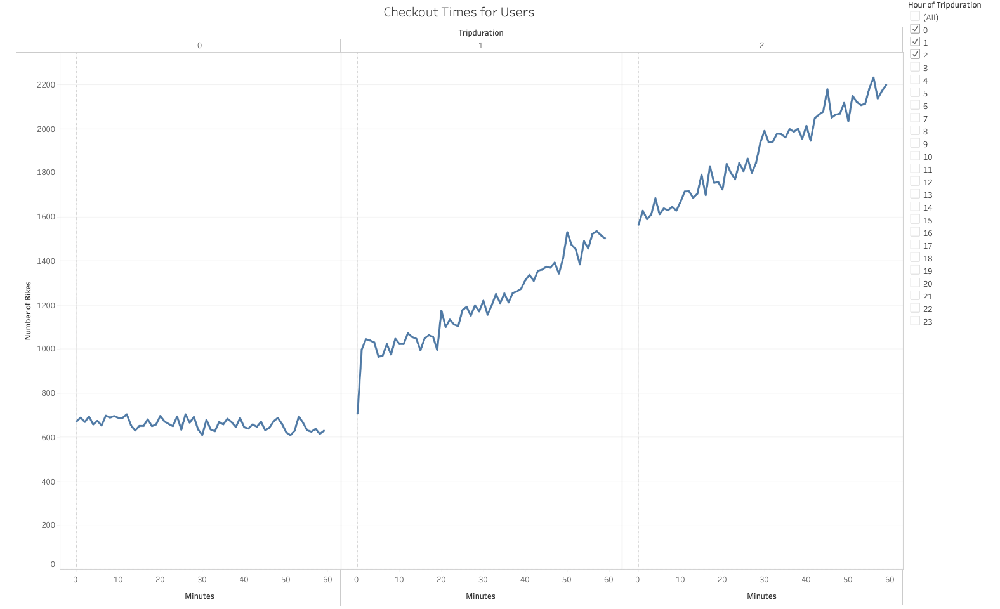
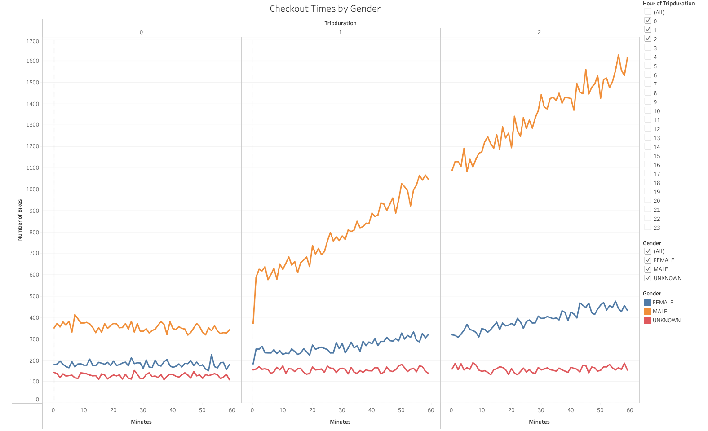
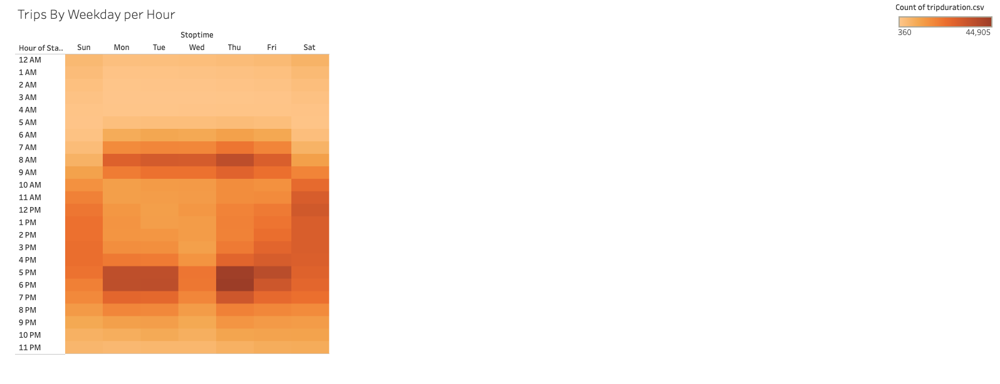
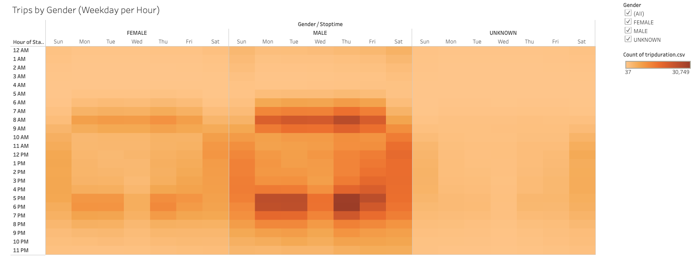
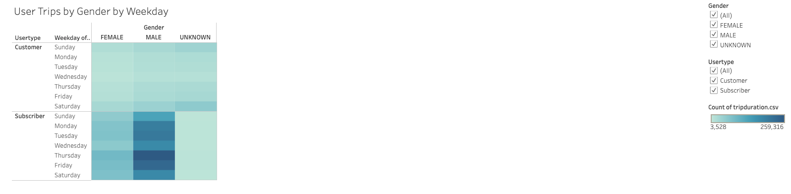
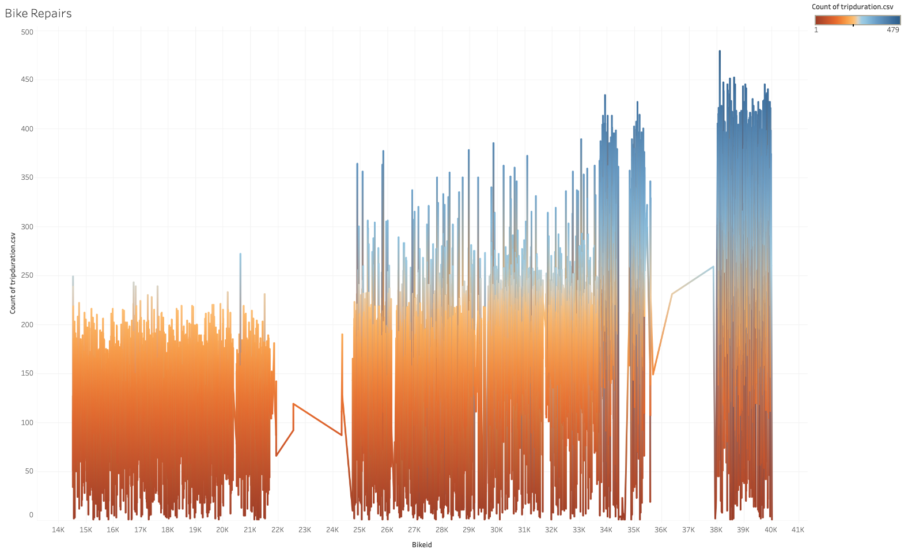
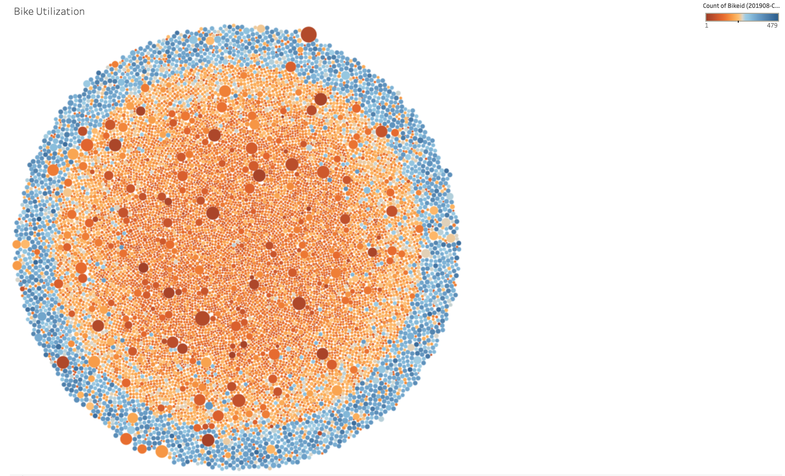

# bikesharing
Bike Sharing in Des Moines!

## Introduction
This analysis will focus on bike activity and will be broken up into the following parts:
- Overview
- Results
  - Checkout Times by User
  - Checkout Times by Gender
  - Trips by Weekday per Hour
  - Trips by Gender by Weekday per Hour
  - User Trips by Gender by Weekday
- Summary/Conclusion
    - Bike Repairs
    - Bike Utilization
  - Dashboard

## Overview
The following analysis is based on the data of New York City's Citi Bike. This company is a bikesharing business where individuals can rent a bike for their needs as either temporary users or subscribers. A similar idea is now being proposed by a new startup firm for the city of Des Moines, Iowa and they needed my help with the analysis portion of their proposal for an angel investor who is already interested in the idea. 

The programs utilized to perform this analysis was of the following:
- Excel
  - Excel held both our initial database and the secondary database with a converted column both as .csv files to be uploaded and read by Tableau
- Pandas
  - Utliized Pandas to convert the "tripduration" column into a to_datetime() function for a cleaner reading in Tableau
- Tableau
  - Program used for our visualizations

## Results:
### Checkout Times for Users
To begin to discuss how Citi Bike will be successful in Des Moines, we will begin with this first graph. We can see that as more bikes become available, more people are using them and using them for longer periods of time.

### Checkout Times by Gender
On this view, we see that more males used the bicycles for longer periods of time than females, and only a small percentage is unknown. 

### Trips by Weekday per Hour
In this view, we can easily see that the bikes are mostly utilized on the way to work in the mornings, after work, and on the weekends, likely for leisure.

### Trips by Gender by Weekday per Hour
Observing this heatmap, both genders utilize the bikes primarily on weekdays, early mornings and evenings, but evenings are the most utilized times overall. This could suggest that in the evenings these bikes are sed both for workday commutes, errands, liesure, and exercise. Men still dominate the usage overall over women. 

### User Trips by Gender by Weekday
In regards to who use the bikes more, not only do males use the bikes more, but also this can be explained by the fact that they are mostly made up of subscribers than once in a while customers. Non-subscribers usages are a bit more equal between the genders, with the men still equating to more usage than women. This however is far more significant in subscribers.

## Summary/Conclusion:
In summary, we are proving that there can be a demand for our services here in Des Moines. As we promote subscribing and we keep bikes available for use, people will keep riding. As we can see in our "Checkout Times for Users" diagram, as bikes become more available as both a cost efficient and liesurely experience of commuting, more and more people will take advantage of this service. Not only this, but also we have shown that there is efficiency with maintaining this dynamic business model along the way through efficient monitoring of bike usages for repairs and maintenance to keep our bicycles on the road. The following diagrams show this information:

- Bike Repairs
Looking at the diagram below, we can see what bike ids are being the most utilized so that we can zoom in on which ids will need priority for bike repairs. Based on the diagram, the bikes of the 25k 35k and 38k to 40k ids will need repairs far more often than others based on the trip duration count.

- Bike Utilization
And finally, this diagram not only shows the bike ids in chronological order by color, but it shows how many trips are taken with that bike id via size of the bubble, and the number of bikes are given in that tab. Basically, this diagram provides the best information for managing repairs because you know how many bikes belong to the particular bike id, and how often they are being used, hinting that they will need more frequent servicing. This diagram also can easily point out where mor ebikes are needed, or possibly even what bike styles are most preferred (if there are various styles availble for use). 

### Dashboard
[link to dashboard](https://public.tableau.com/app/profile/ireion.anthony/viz/CitiBikeChallenge_16294009690250/Citibike_Dashboard?publish=yes)

Happy Biking!
